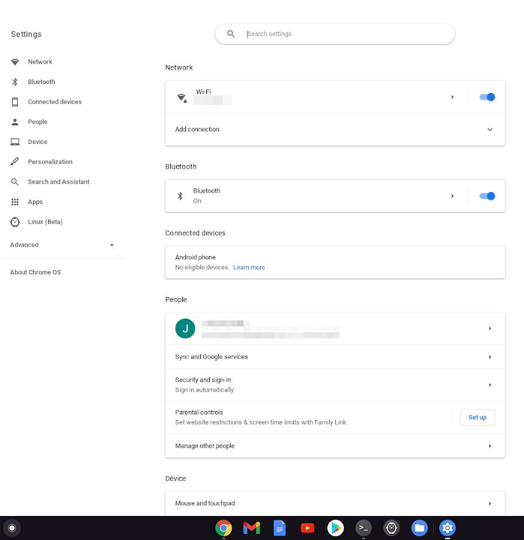

---
hide:
  - navigation
  - toc
author:
- Olivier Friard
slug: |
  chromebook
status: |
  hidden
summary: |
  BORIS on Chrome OS (Chromebook)
title: BORIS for Chromebook
---

{width="100px"}

BORIS cannot run directly on the [Chrome OS](https://www.google.com/chromebook/chrome-os/)
(The operative system of [Chromebook](https://www.google.com/chromebook/)).

Acknowledgement to Jessica Rodda for the following procedure.

It is possible to enable a "true" Linux on the Chrome OS and to use
Python under this Linux (BORIS is coded in Python) as described at:
<https://www.youngwonks.com/blog/Coding-on-a-Chromebook-Using-Python-and-PyGame>

-   Open Settings (bottom right) of the Chromebook

-   You can check if your Chrome OS is the latest version available - if not, update it.

-   Find "Linux (Beta) under Settings - this will allow us to install a
    Linux container within the Chrome OS (some Chromebooks may not have
    this option).



-   Install the Linux using the "turn on"button - if not already turned
    on. Then click install.

-   Once the Linux installation is complete, it automatically opens the
    Linux terminal (or you can open this yourself).

-   Upgrade the packages to the latest version by typing in the
    terminal:

        sudo apt update

-   Install VLC and FFmepg:

        sudo apt install vlc ffmpeg libpulse-mainloop-glib0

-   The minimal version of Python for running Boris is 3.6. Check the
    Python version:

        python3 --version

-   You need to install the python3-venv package:

        sudo apt install python3-venv

-   Create a virtual environment for installing BORIS:

        python3 -m venv boris_venv

You should see a new directory called "boris_venv" with the command: ```ls -l```

If the directory "boris_venv" exists, you have to activate your virtual
environment:

    source boris_venv/bin/activate

-   Install BORIS:

        pip3 install boris-behav-obs

For future BORIS launch, you will only have to activate your virtual
environment:

    source boris_venv/bin/activate

And launch Boris:

    python3 -m boris





If you want to report a bug, see the [how to report a bug](report_a_bug.md) page.
