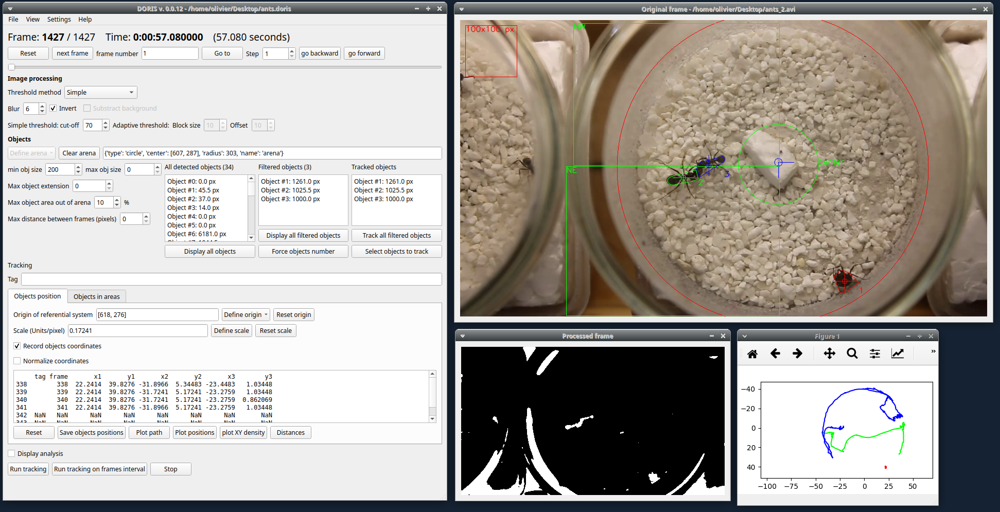

---
hide:
  - navigation
  - toc
author:
- Olivier Friard
title: DORIS
---

{ .off-glb }

# Detection of Object and Tracking

**DORIS** is an easy-to-use interactive object detection and tracking
software with a graphical user interface.

DORIS is a free and open-source software available for GNU/Linux,
Windows and Mac OS.

At the moment DORIS is a project under heavy development. This is an
**ALPHA** release. Use it for testing and reporting bugs and
suggestions.

[Usage of DORIS](https://doris.readthedocs.io)

A [video tutorial](https://www.youtube.com/watch?v=toSXiqsWRzY) is available.

[Latest release on GitHub repository](https://github.com/olivierfriard/DORIS/releases/latest)

[Issues and feature request](https://github.com/olivierfriard/DORIS/issues) on GitHub

## Screenshot

