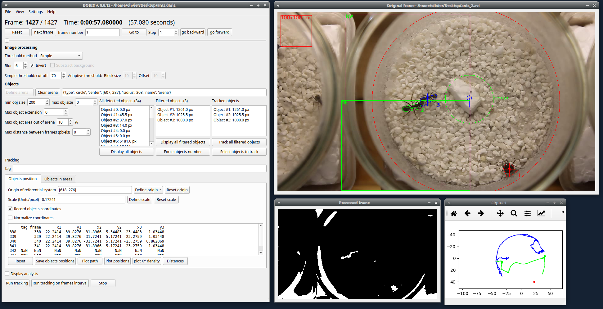

---
hide:
  - navigation
  - toc
author:
- Olivier Friard
title: DORIS
---

{ .off-glb }

# Detection of Object and Tracking

**DORIS** is an easy-to-use interactive object detection and tracking
software with a graphical user interface.

DORIS is a free and open-source software available for GNU/Linux, Microsoft-Windows and macOS.

DORIS is no more developed, if you need a more powerfull tracking softwae you can use [idtracker.ai](https://idtracker.ai) for example.

[DORIS user guide](https://github.com/olivierfriard/DORIS)

A [video tutorial](https://www.youtube.com/watch?v=toSXiqsWRzY) is available.

[Latest release on GitHub repository](https://github.com/olivierfriard/DORIS/releases/latest)

<!-- [Issues and feature request](https://github.com/olivierfriard/DORIS/issues) on GitHub -->

## Screenshot

