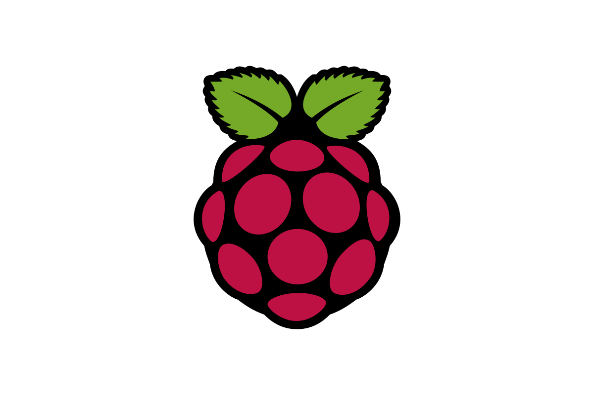

---
hide:
  - navigation
  - toc
author:
- Olivier Friard
title: Download
glightbox: false
---

# Download

!!! danger "**EXTREMELY IMPORTANT**"

    BORIS is distributed **WITHOUT ANY WARRANTY**.  
      
    Please remember that it is extremely important to regularly back up your project files to prevent data loss.  
    While software can be reinstalled, your data might be lost forever if not properly backed up.  
    Use an external drive and/or a cloud service for your backups.  
    Include a timestamp in the file name to avoid overwriting previous backups (e.g., my_project.YYYY-MM-DD.boris).

## Current version: v. **{{ boris.version }}** release date: {{ boris.release_date }}

The user guide is available at <https://www.boris.unito.it/user_guide>.
Feel free to contact me if you want to improve it.



Kindly acknowledge and properly cite this software and its authors when using the results in publications or other forms of dissemination:



If you find this software useful, please send me a [nice postcard](postcards.md) of the place where do you live.

This program is distributed in the hope that it will be useful,
but WITHOUT ANY WARRANTY; without even the implied warranty of
MERCHANTABILITY or FITNESS FOR A PARTICULAR PURPOSE.  See the
[GNU General Public License v.3](https://www.gnu.org/licenses/gpl-3.0.html) for more details.

## [{width=64px} GNU-Linux](download_linux.md)

## [{width=72px} Microsoft-Windows](download_win.md)

## [{width=64px} MacOS](download_mac.md)

## [{width=60px} BORIS App for Android](download_android.md)

## {width="80px"} [Raspberry Pi 4](raspberry_pi_4.md)

## {width="64px"} [Chromebook](chromebook.md)

## [{width=84px} VirtualBox virtual machine](virtual_machine.md)

## [{width=84px} Docker image](docker.md)

## [{width="120px"}](https://github.com/olivierfriard/BORIS) [Install from the Python Package Index (Linux)](run_source_code.md)

## [{width=64px} Download sources](https://github.com/olivierfriard/BORIS/releases/tag/v{{ boris.version }})

All files are signed with [GPG](https://gnupg.org) you can verify their
integrity using my [PGP public
key](http://penelope.unito.it/friard/pubkey.asc).

## Bug report, feature request and discussion

See the [how to report a bug](report_a_bug.md) page.

[Request a feature](https://github.com/olivierfriard/BORIS/issues/new?assignees=&labels=feature+request&template=feature_request.md&title=).

[Suggestions and general
discussion](https://github.com/olivierfriard/BORIS/discussions)

## Test - video samples

You can download video samples to test BORIS on your system:

[video_samples.zip](archive/video_samples.zip) (~ 70 Mb)

## Previous versions

All previous versions of BORIS are available in the [BORIS
releases](https://github.com/olivierfriard/BORIS/releases) archive or in the [BORIS archive](https://drive.google.com/drive/folders/0B0KTzxkLpPJ_bE8zOUFjenFnU3c?resourcekey=0-b9_Ng_8SqK-FIuOP8qIn7w)
for versions prior to 2.99. Please note that the backward compatibility
of a BORIS project is not guaranteed!

## Credits



