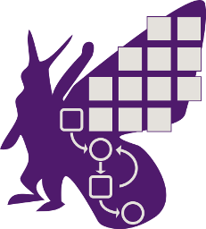

---
hide:
  - navigation
  - toc
author:
- Olivier Friard
title: Other software
glightbox: false
---

## [{width="96px"} Behatrix](behatrix.md)

**Behavioral sequences analysis with permutations test**

## [{width="184px"} DORIS](doris.md)

!!! warning "**This program is no longer maintained**"

    Several excellent automatic tracking tools are available, including [idtracker.ai](https://idtracker.ai), [TRex](https://trex.run), etc

**DORIS** is an easy-to-use interactive object detection and tracking
software with a graphical user interface.
