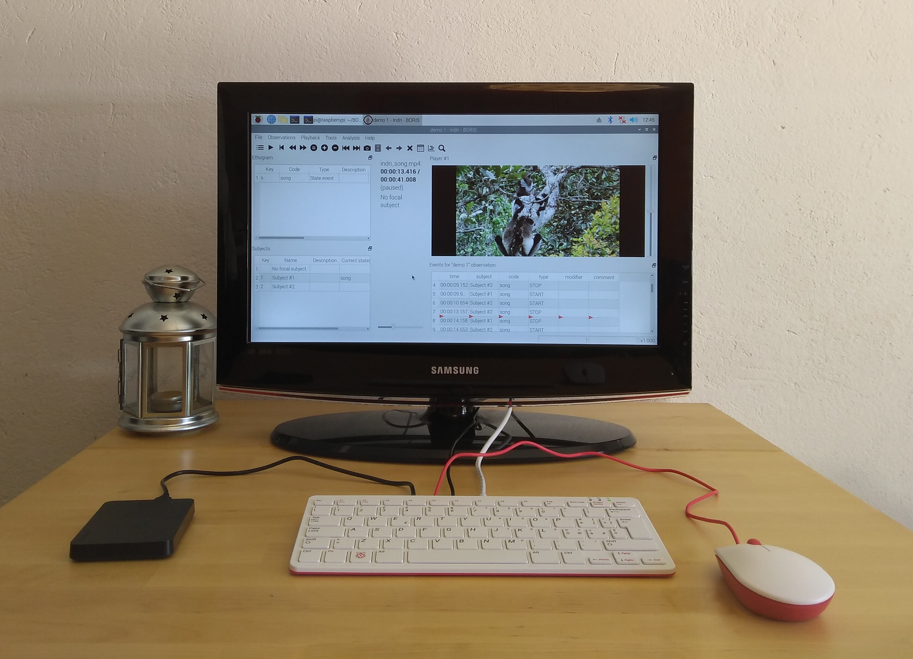

---
hide:
  - navigation
  - toc
author:
- Olivier Friard
slug: |
  raspberry\_pi\_4
status: |
  hidden
summary: |
  BORIS Raspberry Pi 4 / 400
title: Raspberry Pi 4 / 400
---

{width="200px"}

# Raspberry Pi 4 or Raspberry Pi 400

BORIS can be installed on a Raspberry Pi 4 or a [Raspberry Pi
400](https://www.raspberrypi.org/products/raspberry-pi-400)

The Raspberry Pi 400 is a computer that you can buy for less than 100 \$

## Install and launch BORIS on a Raspberry Pi 4 or Raspberry Pi 400

### Installation

This procedure is based on the Raspberry Pi OS (64-bit) and should also
work with another OS versions.

Open a terminal (Click on Raspberry icon > Accessories > Terminal) and
type:

    sudo apt install python3-matplotlib, python3-pyqt5, python3-pyqt5.qtmultimedia, python3-tablib, ffmpeg, graphviz, libmpv1, python3-exifread

    wget https://github.com/olivierfriard/BORIS/archive/refs/tags/v{{ boris.version }}.tar.gz

    tar xfz v{{ boris.version }}.tar.gz

You should see a directory called BORIS-{{ boris.version }}. Remember the
path of this directory in order to launch BORIS.

### Launch BORIS

Open a terminal (Click on Raspberry icon \> Accessories \> Terminal) and
go in the directory where do you extracted BORIS:

    cd BORIS-{{ boris.version }}

    python3 start_boris.py

## Raspberry Pi OS image with BORIS

An image with the Raspberry Pi OS with BORIS already installed (v.{{ boris.version }}) is available at:

[Raspberry Pi OS (64-bit) with BORIS
installed](https://drive.google.com/file/d/1RCE9uAOm6TdJ3y-1Ol3JHH-UWWjSny1Y/view?usp=sharing)
(file size: 1.6 Gb)

The image can be installed on a microSD (>= 8 Gb) using the [Raspberry
Pi Imager software](https://www.raspberrypi.com/software/).

Choose OS > Use custom > Select the downloaded image
(raspberry-pi_os_boris.img.gz)

See the revision history for details:
<https://github.com/olivierfriard/BORIS/wiki/BORIS-revision-history>

If you want to report a bug, see the [how to report a bug](report_a_bug.md) page.
